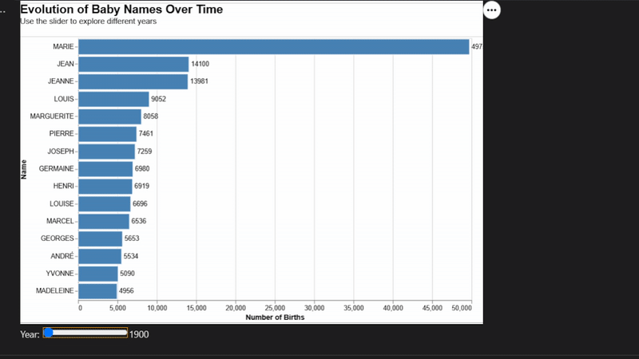
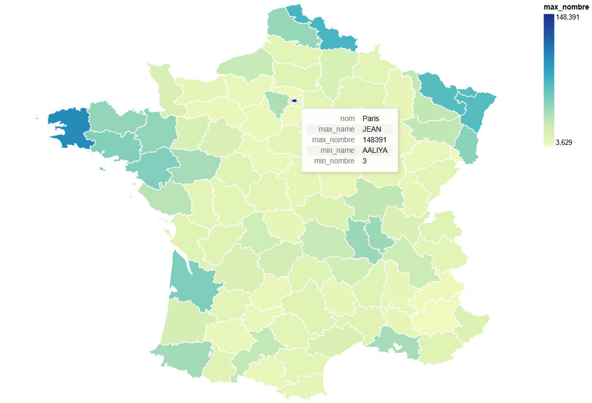
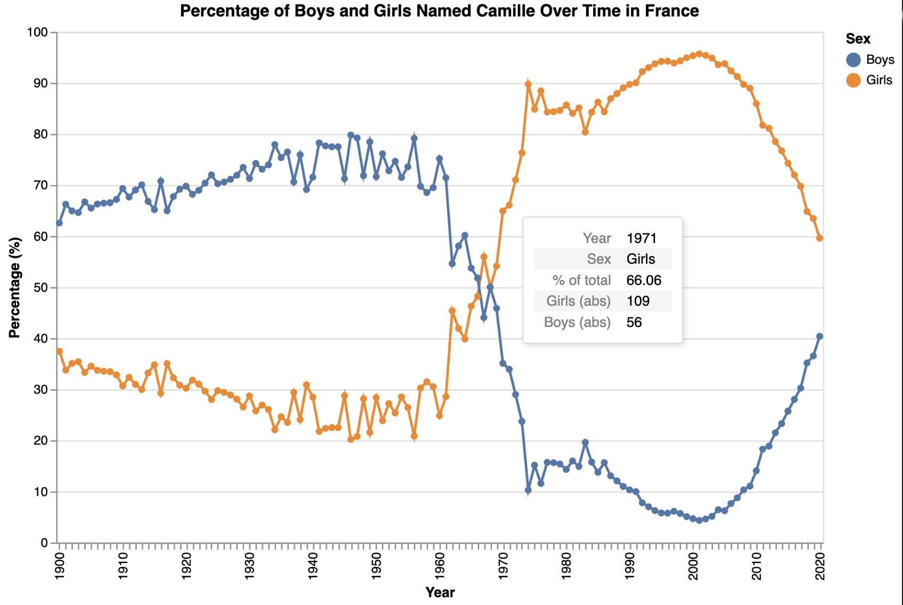

# French Baby Names Visualization

This project provides interactive visualizations for exploring French baby name data through a Streamlit web application.

## Visualizations

### Visualization 1: Top Names Over Time

This visualization provides a comprehensive overview of the most popular names in France from 1940 to 2020, it allows users to explore the evolution of names over time through the year slider, which adjusts the data displayed in the chart. The chart displays the top 15 names for each year with the count of each name.

### Visualization 2: Regional Name Map

To explore whether certain names are more popular in specific regions, this visualization aggregates the data across all years and displays, for each department, the most frequently used name along with its count. This approach provides an immediate overview of regional patterns by highlighting dominant names in each area.

### Visualization 3: Name Gender Distribution

Visualization that gives for the chosen name and chosen department displays the name's gender tendecies 
- Y-axis was chosen to display in relative scale (percent of boys-girls) 
- Hover over a datapoint gives acces to absolute numbers

## Running the project locally

1. Make sure you have the necessary libraries installed:
```bash
pip install -r requirements.txt
```

2. Run the Streamlit app:
```bash
streamlit run app.py
```

## Deployment to Heroku

### Prerequisites
- GitHub account
- Heroku account
- Git installed locally

### Steps to deploy

1. Push your code to GitHub:
```bash
git init
git add .
git commit -m "Initial commit"
git branch -M main
git remote add origin https://github.com/yourusername/your-repo-name.git
git push -u origin main
```

2. Connect your GitHub repository to Heroku:
   - Create a new app on Heroku
   - Go to the "Deploy" tab
   - Choose "GitHub" as the deployment method
   - Connect to your GitHub repository
   - Enable automatic deploys from your main branch

3. Make sure your repository contains:
   - `app.py` - Main Streamlit application
   - `requirements.txt` - Dependencies
   - `Procfile` - Command to run the app (web: streamlit run app.py --server.port=$PORT)
   - `runtime.txt` - Python version (python-3.9.18)
   - `setup.sh` - Streamlit configuration

4. Verify buildpacks:
   - Go to "Settings" tab in Heroku
   - Under "Buildpacks", make sure "heroku/python" is added
   - If not, click "Add buildpack" and select Python

5. Environment variables:
   - In Heroku, go to "Settings" > "Config Vars"
   - Add any environment variables needed by your app

6. Deploy:
   - Click "Deploy Branch" in the Heroku dashboard
   - Once deployed, click "Open App" to view your application

### Troubleshooting deployment

If you encounter the H14 error "No web processes running":

1. Verify your Procfile has the correct format (no comments, proper syntax)
2. Check logs to see why the process isn't starting:
```bash
heroku logs --tail
```
3. Make sure all dependencies are specified in requirements.txt
4. Try restarting the dynos:
```bash
heroku ps:scale web=1
```

### Data files
Make sure all data files (`dpt2020.csv` and `departements-version-simplifiee.geojson`) are included in your repository so they can be accessed by the deployed application.

